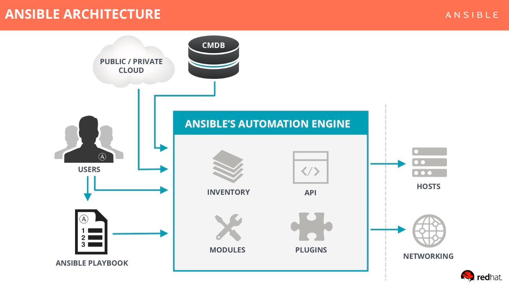

# Ansible
## Getting started video
<p><a href="https://www.ansible.com/resources/get-started?wvideo=qrqfj371b6#"></a></p><p><a href="https://www.ansible.com/resources/get-started?wvideo=qrqfj371b6#">Getting Started with Ansible | Ansible.com</a></p>

## Architecture


## Modules
Modules control system resources, packages, files or nearly anything else. Example *apt*
```
module: directive1=value1 directive2=value2
```

## Variables
Variables make it easy to configure and alternate some configurations. Example: *a pakcage version, username .. etc*.
They could be used in playbooks, files, inventories and command line.

## Inventories
List of target machines which could be: static servers, ranges, dynamic servers on AWS, GCP ...etc 
```
[webservers]
www1.example.com
www2.example.com

[dbservers]
db0.example.com
db1.example.com
```

## Playbooks
Plain text YAML files that describe the desired state of something.

Playbooks are Ansible’s configuration, deployment, and orchestration language. They can describe a policy you want your remote systems to enforce, or a set of steps in a general IT process.

If Ansible modules are the tools in your workshop, playbooks are your instruction manuals, and your inventory of hosts are your raw material.

- Playbooks contains **plays**
- Plays contain **tasks**
- Tasks contain **modules**
- Tasks runs **sequentially** (mimicking you typing command lines)
- **Handlers** are triggered by tasks, and run once at the end of plays.

```yaml
---
- hosts: webservers
  remote_user: root

  tasks:
  - name: ensure apache is at the latest version
    yum:
      name: httpd
      state: latest
  - name: write the apache config file
    template:
      src: /srv/httpd.j2
      dest: /etc/httpd.conf

- hosts: databases
  remote_user: root

  tasks:
  - name: ensure postgresql is at the latest version
    yum:
      name: postgresql
      state: latest
  - name: ensure that postgresql is started
    service:
      name: postgresql
      state: started
```

## Roles
Roles are special kind of Playbooks that are fully self-contained with tasks, variables, configuration templates and other supporting files.
