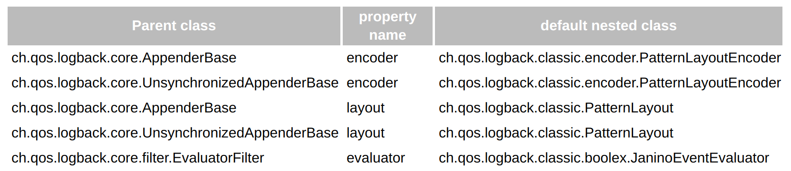

# LogBack

## How it works ?

Let us begin by discussing the initialization steps that logback follows to try to configure itself:

1. Logback tries to find a file called logback.groovy in the classpath.
2. If no such file is found, logback tries to find a file called logback-test.xml in the classpath.
3. If no such file is found, it checks for the file logback.xml in the classpath.
4. If neither file is found, logback configures itself automatically using the [`BasicConfigurator`](http://logback.qos.ch/apidocs/ch/qos/logback/classic/BasicConfigurator.html)which will cause logging output to be directed to the console. This minimal configuration consists of a[`ConsoleAppender`](http://logback.qos.ch/apidocs/ch/qos/logback/core/ConsoleAppender.html) attached to the root logger. The output is formatted using a[`PatternLayoutEncoder`](http://logback.qos.ch/apidocs/ch/qos/logback/classic/encoder/PatternLayoutEncoder.html) set to the pattern `%d{HH:mm:ss.SSS} [%thread] %-5level %logger{36} – %msg%n`. Moreover, by default the root logger is assigned the DEBUG level.

## Loggers

Logger is the client code that executes the log events

Every single logger is attached to a`LoggerContext`which is responsible for manufacturing loggers as well as arranging them in a tree like hierarchy.

Level order:`TRACE < DEBUG < INFO <  WARN < ERROR`.

Retrieving Loggers: [LoggerFactory.getLogger](https://logback.qos.ch/apidocs/org/slf4j/LoggerFactory.html#getLogger%28java.lang.String%29)

Loggers are named entities. Their names are case-sensitive and they follow the hierarchical naming rule \(like java classes\)

### Appenders

In logback speak, an output destination is called an appender. Appenders must implement the[`ch.qos.logback.core.Appender`](http://logback.qos.ch/apidocs/ch/qos/logback/core/Appender.html).

More than one appender can be attached to a logger.

Appenders are inherited additively from the logger hierarchy this is called **Appender Adivitiy** and can be disabled by setting `AditivityFlag` to `false`.

## Layouts

The layout is responsible for formatting the logging request.

Example:

`%-4relative [%thread] %-5level %logger{32} - %msg%n`

will output something akin to:

```
176  [main] DEBUG manual.architecture.HelloWorld2 - Hello world.
```

## Parametrized logging

```java
logger.debug("Entry number: " + i + " is " + String.valueOf(entry[i]);
```

This is will incur the cost of evaluting and constructing the string message even if the debug logging is not enabled

A better alternative is:

```java
Object entry = new SomeObject(); 
logger.debug("The entry is {}.", entry);
```

### A peek under the hood

Let us now analyze the steps logback takes when the user invokes the`info()`method of a logger named`com.wombat`

1. **Get the filter chain decision:** If it exists, the`TurboFilter`chain is invoked. Turbo filters can set a context-wide threshold, or filter out certain events based on information such as`Marker`,`Level`,`Logger`, message, or the`Throwable`that are associated with each logging request. If the reply of the filter chain is`FilterReply.DENY`, then the logging request is dropped. If it is`FilterReply.NEUTRAL`, then we continue with the next step, i.e. step 2. In case the reply is`FilterReply.ACCEPT`, we skip the next and directly jump to step 3.
2. **Apply the **[**basic selection rule**](https://logback.qos.ch/manual/architecture.html#basic_selection)

3. **Create a**`LoggingEvent`**object**

4. ** Invoking appenders**

5. **Formatting the output**

6. **Sending out the**`LoggingEvent`

## Basic Configuration

```xml
<configuration>

  <appender name="STDOUT" class="ch.qos.logback.core.ConsoleAppender">
    <!-- encoders are assigned the type
         ch.qos.logback.classic.encoder.PatternLayoutEncoder by default -->
    <encoder>
      <pattern>%d{HH:mm:ss.SSS} [%thread] %-5level %logger{36} - %msg%n</pattern>
    </encoder>
  </appender>

  <root level="debug">
    <appender-ref ref="STDOUT" />
  </root>
</configuration>
```

you can instruct the configuration file to dump status data, even in the absence of errors. To achieve this, you need to set the debug attribute of the configuration element

### Specifying the location of the default configuration file as a system property

```bash
java -Dlogback.configurationFile=/path/to/config.xml chapters.configuration.MyApp1
```

## Configuration file syntax


#### Configuring loggers, or the`<logger>`element

**Attributes**: `name`, `level`, `additivity`, `inherited` \(force it to inherit from ancestor\)

The `logger` element my contain zero or more `appender-ref`

#### Configuring the root logger, or the`<root>`element

The `root` logger accept only the `level` attribute and my contain zero or more `appender-ref`

### Note !

Let us note that the [basic-selection rule](https://logback.qos.ch/manual/architecture.html#basic_selection) depends on the effective level of the logger being invoked, not the level of the logger where appenders are attached. Logback will first determine whether a logging statement is enabled or not, and if enabled, it will invoke the appenders found in the logger hierarchy, regardless of their level. The following configuration file is a case in point

```xml
<configuration>

  <appender name="STDOUT"
   class="ch.qos.logback.core.ConsoleAppender">
   <encoder>
     <pattern>
        %d{HH:mm:ss.SSS} [%thread] %-5level %logger{36} - %msg%n
      </pattern>
    </encoder>
  </appender>

  <logger name="chapters.configuration" level="INFO" />

  <!-- turn OFF all logging (children can override) -->
  <root level="OFF">
    <appender-ref ref="STDOUT" />
  </root>

</configuration>
```

the level of the root logger has no apparent effect because the loggers in `chapters.configuration.*` are enabled for the`INFO`level

#### Configuring Appender


#### Example

```xml
<configuration>

  <appender name="FILE" class="ch.qos.logback.core.FileAppender">
    <file>myApp.log</file>

    <encoder>
      <pattern>%date %level [%thread] %logger{10} [%file:%line] %msg%n</pattern>
    </encoder>
  </appender>

  <appender name="STDOUT" class="ch.qos.logback.core.ConsoleAppender">
    <encoder>
      <pattern>%msg%n</pattern>
    </encoder>
  </appender>

  <root level="debug">
    <appender-ref ref="FILE" />
    <appender-ref ref="STDOUT" />
  </root>
</configuration>
```

#### Be careful

By default, **appenders are cumulative**: a logger will log to the appenders attached to itself \(if any\) as well as all the appenders attached to its ancestors. Thus, attaching the same appender to multiple loggers will cause logging output to be **duplicated**.

#### How to disable ?

```xml
<configuration>

  <appender name="FILE" class="ch.qos.logback.core.FileAppender">
    <file>foo.log</file>
    <encoder>
      <pattern>%date %level [%thread] %logger{10} [%file : %line] %msg%n</pattern>
    </encoder>
  </appender>

  <appender name="STDOUT" class="ch.qos.logback.core.ConsoleAppender">
    <encoder>
      <pattern>%msg%n</pattern>
    </encoder>
  </appender>

  <logger name="chapters.configuration.Foo" additivity="false">
    <appender-ref ref="FILE" />
  </logger>

  <root level="debug">
    <appender-ref ref="STDOUT" />
  </root>
</configuration>
```

#### Sniffing Appender

```xml
<configuration>

  <appender name="SIFT" class="ch.qos.logback.classic.sift.SiftingAppender">
    <!-- in the absence of the class attribute, it is assumed that the
         desired discriminator type is
         ch.qos.logback.classic.sift.MDCBasedDiscriminator -->
    <discriminator>
      <key>userid</key>
      <defaultValue>unknown</defaultValue>
    </discriminator>
    <sift>
      <appender name="FILE-${userid}" class="ch.qos.logback.core.FileAppender">
        <file>${userid}.log</file>
        <append>false</append>
        <layout class="ch.qos.logback.classic.PatternLayout">
          <pattern>%d [%thread] %level %mdc %logger{35} - %msg%n</pattern>
        </layout>
      </appender>
    </sift>
  </appender>

  <root level="DEBUG">
    <appender-ref ref="SIFT" />
  </root>
</configuration>
```

## Default Mapping Classes

# Mapped Diagnostic Context

To use MDC just call the `MDC.put` method and refer to the variable with `%key` in the pattern of layouts or `${key}` in the file name pattern of Appenders using `SiftingAppender`

## Conditions

```xml
<configuration debug="true">

  <if condition='property("HOSTNAME").contains("torino")'>
    <then>
      <appender name="CON" class="ch.qos.logback.core.ConsoleAppender">
        <encoder>
          <pattern>%d %-5level %logger{35} - %msg %n</pattern>
        </encoder>
      </appender>
      <root>
        <appender-ref ref="CON" />
      </root>
    </then>
  </if>

  <appender name="FILE" class="ch.qos.logback.core.FileAppender">
    <file>${randomOutputDir}/conditional.log</file>
    <encoder>
      <pattern>%d %-5level %logger{35} - %msg %n</pattern>
   </encoder>
  </appender>

  <root level="ERROR">
     <appender-ref ref="FILE" />
  </root>
</configuration>
```
## Size and time based rolling policy

```bash
<configuration>
  <appender name="ROLLING" class="ch.qos.logback.core.rolling.RollingFileAppender">
    <file>mylog.txt</file>
    <rollingPolicy class="ch.qos.logback.core.rolling.SizeAndTimeBasedRollingPolicy">
      <!-- rollover daily -->
      <fileNamePattern>mylog-%d{yyyy-MM-dd}.%i.txt</fileNamePattern>
       <!-- each file should be at most 100MB, keep 60 days worth of history, but at most 20GB -->
       <maxFileSize>100MB</maxFileSize>    
       <!-- if maxHistory is not set: 'maxHistory' is not set, ignoring 'totalSizeCap' option with value [10 KB] -->
       <maxHistory>60</maxHistory>
       <totalSizeCap>20GB</totalSizeCap>
    </rollingPolicy>
    <encoder>
      <pattern>%msg%n</pattern>
    </encoder>
  </appender>


  <root level="DEBUG">
    <appender-ref ref="ROLLING" />
  </root>

</configuration>
```

!!! note
    `totalSizeCap` is ignored if `maxHistory` is not set

## Compression
To enable compression just name your file `*.gz` or `*.zip` and logback will do that for you

!!! example
    file property set to `/wombat/foo.txt`: During November 23rd, 2009, logging output will go to the file `/wombat/foo.txt`. At midnight that file will be compressed and renamed as `/wombat/foo.2009-11-23.gz`. A new `/wombat/foo.txt` file will be created where logging output will go for the rest of November 24rd. At midnight November 24th, `/wombat/foo.txt` will be compressed and renamed as `/wombat/foo.2009-11-24.gz` and so on.

!!! note
    File compresion is not support in [prudent mode](https://logback.qos.ch/manual/appenders.html#prudentWithRolling)

