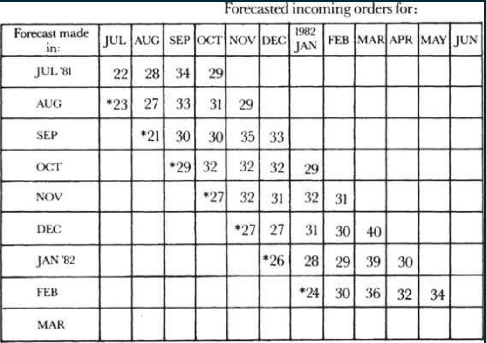

# Managing the Breakfast Factory

## Indicators as a Key Tool

Indicators help you measure the quality and the throughput of the proccess.

> a genuinely effective indicator will cover the *output of the work unit* and not simply the *activity involved*

> you measure should be a *physical*, *countable* thing

### Paring indicators

indicators should be paired together so that together both effect and counter-effect are measured

!!! example
    In the inventory example, you need to monitor both inventory levels and the incidence of shortages. A rise in the latter will obviously lead you to do things to keep inventories from becoming too low.

### Advantages

* You have a way to measure he objectives of an employe or a group.
* You can compare employes doing the same thing, or maybe use that measure to motivate them to compete each others.

## The Black Box
We can think of all sort of process as black box who consume inputs and produce outputs just like a function in computer science :p

### Leading indicators
Give you one way to look inside the black box by showing you in advance what the future might look like. And because they give you time to take corrective action, they make it possible for you to avoid problems.

!!! example
    Daily monitors for machine downtime or customer satisfaction

### linearity indicator
Draw a line of output against time to be able to see how far you are from the goal and thus make decision before deadline arrive.

### Trend indicators
measured against time performance this month versus performance over a series of previous months, and also against some standard or expected level.

### Stagger charts

Forecast the value of an output for the next months, this will allow you to get insights about the future and also to improve your forecasting model (backpropagation :D)

## Controlling Future Output
Two ways for controlling the future

### Build to order

Like when you need a customized color for a card that is not available

### Build to forecast

Try to forecast the orders, build products for them with the risk of not materialized orders.

Like companies that recruits employes based on forecasted work.

Building the product and selling it are two separate processes that have different live cycle. Ideally, the order for the product and the product itself should arrive on the shipping dock at the same time.

Forecasts should not be done by one person and performed by others, what it works better ask both the manufacturing and the sales departments to prepare a forecast, so that people are responsible for performing against their own predictions.
If we have choosen carefully our indicators, and we beleive in them, even administravie work whcih lack objective estimation could be forecast.

## Assuring quality

We must run inspection point on every process stage, it's vitally important to reject an invetory in the earliest stage where it has the lowes-price possible called *incoming material inspection* or *receiving inspection*.

After detecting a defective invetory we can *return them the vendor*, *use it in order to not stop the production process*, such decision are made by managers in different departements (design, manufacturing and quality inssurance). We should be aware that no rejecting defective invetory could cause a complete failure — a reliability problem — for our customer and the cost is much more that an financial problem.

!!! example
    Rejecting the idea of using **SQL** to store streaming data before you even face problem of scalability is much more from wast you time building the app and face the problem and then reiterate to another technology like **Kafka**.

### Balancing between Quality, Inspections and minimun Disturbance

**Gate-like inspection** inspection is done in the input, if it pass the product pass to the next stage, if not it's returned to the previous one for reworking or rejected.

**Variable inspection** is not common because we are creature and we have habit to keep doing what we used to do.

## Productivity
Productivity is the ratio between the output and the labor required to generate that output.

### Increase Productivity: Our lives purpose
We can increase productivity by doing whatever we were doing **faster**.

We can also, more importantly, increase productivity by **increasing the leverage of the activities**, simplifying the manufacturing process steps (remove not important, inherited or duplicated steps). We have to draw a production chart of **all** steps and then ask the question _why every step is here ?_
